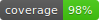

[](https://github.com/inquirex/inquirex-llm/actions/workflows/main.yml)  

# inquirex-llm

LLM integration verbs for the [Inquirex](https://github.com/inquirex/inquirex) questionnaire engine.

Extends the core DSL with four server-side verbs -- `clarify`, `describe`, `summarize`, and `detour` -- that bridge free-text answers and structured data via LLM processing. Ships with a pluggable adapter interface and a `NullAdapter` for testing.

## Status

- Version: `0.1.0`
- Ruby: `>= 4.0.0`
- Test suite: `111 examples, 0 failures`
- Depends on: `inquirex` (core gem)

## Installation

```ruby
gem "inquirex-llm"
```

## Usage

`require "inquirex-llm"` injects the LLM verbs into the core `Inquirex.define` DSL. No separate entry point needed.

```ruby
require "inquirex"
require "inquirex-llm"

definition = Inquirex.define id: "tax-intake-2026", version: "1.0.0" do
  start :description

  ask :description do
    type :text
    question "Describe your business in a few sentences."
    transition to: :extracted
  end

  clarify :extracted do
    from :description
    prompt "Extract structured business information from the description."
    schema industry:          :string,
           entity_type:       :string,
           employee_count:    :integer,
           estimated_revenue: :currency
    model :claude_sonnet
    temperature 0.2
    transition to: :summary
  end

  summarize :summary do
    from_all
    prompt "Summarize this client's tax situation and flag complexity concerns."
    transition to: :done
  end

  say :done do
    text "Thank you! We'll be in touch."
  end
end
```

All core verbs (`ask`, `say`, `header`, `btw`, `warning`, `confirm`) and widget hints work alongside LLM verbs in the same `Inquirex.define` block.

## LLM Verbs

### `clarify`

Extract structured data from a free-text answer. Requires `from`, `prompt`, and `schema`.

```ruby
clarify :business_extracted do
  from :business_description
  prompt "Extract structured business information."
  schema industry: :string, employee_count: :integer, revenue: :currency
  model :claude_sonnet
  temperature 0.2
  max_tokens 1024
  transition to: :next_step
end
```

### `describe`

Generate natural-language text from structured data. Requires `from` and `prompt`. No schema needed.

```ruby
describe :business_narrative do
  from :business_extracted
  prompt "Write a brief narrative of this business for the intake report."
  transition to: :next_step
end
```

### `summarize`

Produce a summary of all or selected answers. Use `from_all` to pass everything, or `from` to select specific steps.

```ruby
summarize :intake_summary do
  from_all
  prompt "Summarize this client's tax situation."
  transition to: :review
end
```

### `detour`

Dynamically generate follow-up questions based on an answer. The server adapter handles presenting the generated questions and collecting responses. Requires `from`, `prompt`, and `schema`.

```ruby
detour :followup do
  from :description
  prompt "Generate 2-3 follow-up questions to clarify the tax situation."
  schema questions: :array, answers: :hash
  transition to: :next_step
end
```

## DSL Methods (inside LLM verb blocks)

| Method | Purpose | Required |
|--------|---------|----------|
| `prompt "..."` | LLM prompt template | Always |
| `schema key: :type, ...` | Expected output structure | `clarify`, `detour` |
| `from :step_id` | Source step(s) whose answers feed the LLM | `clarify`, `describe`, `detour` |
| `from_all` | Pass all collected answers to the LLM | Alternative to `from` |
| `model :claude_sonnet` | Optional model hint for the adapter | No |
| `temperature 0.3` | Optional sampling temperature | No |
| `max_tokens 1024` | Optional max output tokens | No |
| `fallback { \|answers\| ... }` | Server-side fallback (stripped from JSON) | No |
| `transition to: :step` | Conditional transition (same as core) | No |
| `skip_if rule` | Skip step when condition is true | No |

## Engine Integration

The engine treats LLM steps as collecting steps. The server adapter processes the LLM call and feeds the result back:

```ruby
engine = Inquirex::Engine.new(definition)

engine.answer("I run an LLC with 15 employees, ~$2M revenue.")
# engine.current_step_id => :extracted

# Server-side: adapter calls the LLM
adapter = MyLlmAdapter.new
result = adapter.call(engine.current_step, engine.answers)
# => { industry: "Technology", employee_count: 15, revenue: 2_000_000.0 }

engine.answer(result)
# engine.current_step_id => :summary
```

For testing, use `NullAdapter` which returns schema-conformant placeholder values without any API calls:

```ruby
adapter = Inquirex::LLM::NullAdapter.new
result = adapter.call(engine.current_step)
# => { industry: "", employee_count: 0, revenue: 0.0 }
```

## Built-in Adapters

| Class | Provider | API | Auth | Key env var |
|------------------------------------|-----------|---------------------------------------|-----------------------------|-----------------------|
| `Inquirex::LLM::NullAdapter` | — | none (placeholders) | none | — |
| `Inquirex::LLM::AnthropicAdapter` | Anthropic | `/v1/messages` | `x-api-key` header | `ANTHROPIC_API_KEY` |
| `Inquirex::LLM::OpenAIAdapter` | OpenAI | `/v1/chat/completions` (JSON mode) | `Authorization: Bearer …` | `OPENAI_API_KEY` |

Both real adapters use `net/http` (stdlib, no extra dependency), inject the
declared `schema` into the system prompt as a strict JSON contract, and raise
`Inquirex::LLM::Errors::AdapterError` on HTTP / parse failures and
`SchemaViolationError` when the model's output is missing declared fields.

### AnthropicAdapter

```ruby
adapter = Inquirex::LLM::AnthropicAdapter.new(
  api_key: ENV["ANTHROPIC_API_KEY"],
  model:   "claude-sonnet-4-20250514"   # or pass the short symbol in the DSL
)
```

Recognized `model :symbol` values in the DSL: `:claude_sonnet`,
`:claude_haiku`, `:claude_opus` (mapped to the current concrete model ids).

### OpenAIAdapter

```ruby
adapter = Inquirex::LLM::OpenAIAdapter.new(
  api_key: ENV["OPENAI_API_KEY"],
  model:   "gpt-4o-mini"
)
```

Uses Chat Completions with `response_format: { type: "json_object" }` so the
model is constrained to return valid JSON. Recognized DSL symbols: `:gpt_4o`,
`:gpt_4o_mini`, `:gpt_4_1`, `:gpt_4_1_mini`. For cross-provider portability,
the adapter also accepts the Claude symbols (`:claude_sonnet` → `gpt-4o` etc.)
so a flow file that says `model :claude_sonnet` runs unchanged against either
provider.

## LLM-assisted Pre-fill Pattern

A common use case: ask *one* open-ended question, let the LLM extract answers
for *many* downstream questions, and only prompt the user for what the LLM
couldn't determine. This is what the core engine's `Engine#prefill!` is for:

```ruby
definition = Inquirex.define id: "tax-intake" do
  start :describe

  ask :describe do
    type :text
    question "Describe your 2025 tax situation."
    transition to: :extracted
  end

  clarify :extracted do
    from :describe
    prompt "Extract: filing_status, dependents, income_types, state_filing."
    schema filing_status: :string,
           dependents:    :integer,
           income_types:  :multi_enum,
           state_filing:  :string
    model :claude_sonnet
    transition to: :filing_status
  end

  ask :filing_status do
    type :enum
    question "Filing status?"
    options %w[single married_filing_jointly head_of_household]
    skip_if not_empty(:filing_status)     # ← the whole trick
    transition to: :dependents
  end

  ask :dependents do
    type :integer
    question "How many dependents?"
    skip_if not_empty(:dependents)
    transition to: :income_types
  end
  # …and so on for every field in the clarify schema
end

engine  = Inquirex::Engine.new(definition)
adapter = Inquirex::LLM::OpenAIAdapter.new  # or AnthropicAdapter

engine.answer("I'm MFJ with two kids in California, W-2 plus some crypto.")
result = adapter.call(engine.current_step, engine.answers)
engine.answer(result)         # stored under :extracted
engine.prefill!(result)       # splats into top-level answers

# Every downstream step whose skip_if rule now evaluates true gets
# auto-skipped by the engine. engine.current_step_id jumps straight to
# whichever field the LLM couldn't fill in.
```

`Engine#prefill!` is non-destructive (won't clobber an answer the user already
gave), ignores `nil`/empty values so they don't spuriously trigger
`not_empty`, and auto-advances past any step whose `skip_if` now evaluates
true. See [examples/09_tax_preparer_llm.rb](../inquirex-tty/examples/09_tax_preparer_llm.rb)
for a complete runnable flow, or the repo-level `demo_llm_intake.rb` for a
scripted end-to-end walkthrough.

## JSON Serialization

LLM steps serialize with `"requires_server": true` so the JS widget knows to round-trip to the server. LLM metadata lives under an `"llm"` key:

```json
{
  "verb": "clarify",
  "requires_server": true,
  "transitions": [{ "to": "summary", "requires_server": true }],
  "llm": {
    "prompt": "Extract structured business information.",
    "schema": {
      "industry": "string",
      "employee_count": "integer",
      "revenue": "currency"
    },
    "from_steps": ["business_description"],
    "model": "claude_sonnet",
    "temperature": 0.2,
    "max_tokens": 1024
  }
}
```

Fallback procs are stripped from JSON (server-side only).

## Custom Adapter

Subclass `Inquirex::LLM::Adapter` and implement `#call(node, answers)`:

```ruby
class MyLlmAdapter < Inquirex::LLM::Adapter
  def call(node, answers)
    source = source_answers(node, answers)
    response = my_llm_client.complete(
      node.prompt,
      context: source,
      model: node.model,
      temperature: node.temperature
    )
    result = parse_response(response)
    validate_output!(node, result)
    result
  end
end
```

The base class provides `#source_answers` (gathers relevant answers) and `#validate_output!` (checks schema conformance).

## Development

```bash
bundle install
bundle exec rspec
bundle exec rubocop
```

## License

MIT. See [LICENSE.txt](LICENSE.txt).
